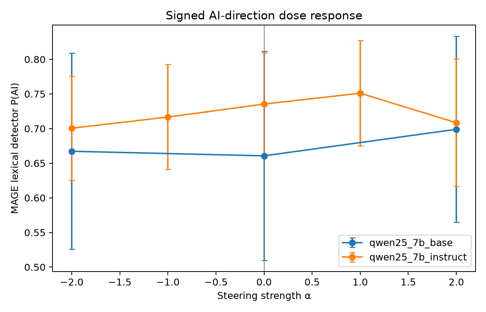
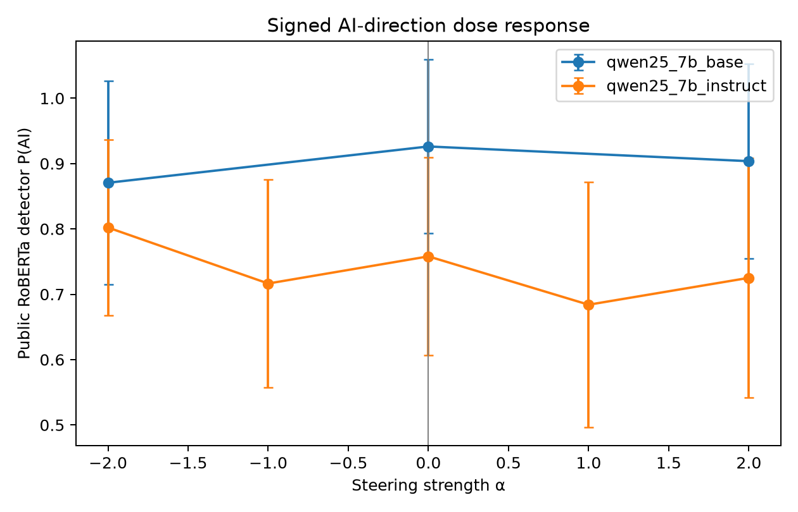
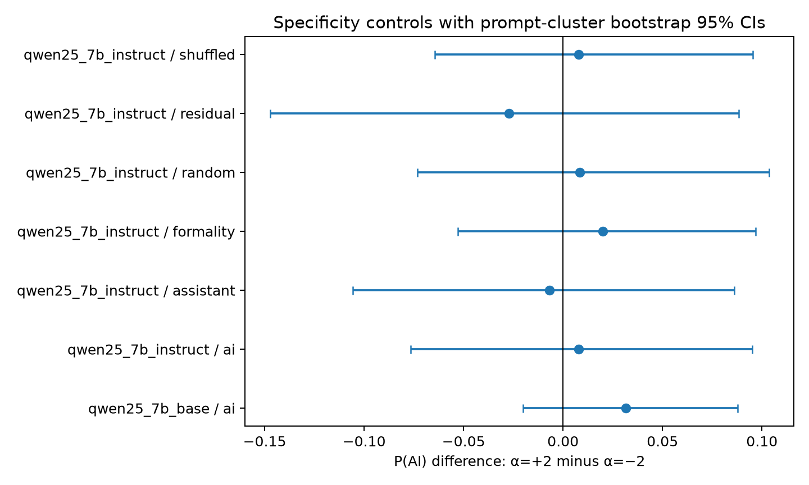

# Is There a “Sounds Like AI” Direction in the Residual Stream?

## 1. Executive Summary

This study asked whether a residual-stream direction that reads out human versus machine authorship also causally controls how AI-like a model's own writing appears. In Qwen2.5-7B-Instruct and its pretrained base counterpart, authorship was almost perfectly linearly readable from content-paired HAP-E continuations (selected-layer held-out AUROC 0.9997 in both checkpoints). The direction was nearly orthogonal to same-model Assistant and formality axes.

The causal result was negative at the tested layer and doses. In 16 held-out instruct-model prompt clusters, changing the raw direction from α=−2 to α=+2 changed a MAGE-trained detector's P(AI) by only +0.008 (95% cluster-bootstrap CI [−0.077, +0.095]) and an independently trained public RoBERTa detector's P(AI) by −0.077 [−0.246, +0.057]. Neither endpoint was significant before or after Holm correction, the two detectors disagreed in sign, and the fully nuisance-orthogonal direction was also null. A 12-prompt base-model replication was similarly null. At these doses, the null was not explained by obvious coherence collapse: word count, repetition, embedding similarity, and base-Qwen perplexity did not materially worsen across the raw endpoints.

The strongest warranted conclusion is therefore asymmetric: this run provides strong within-design evidence for a readable authorship direction, but no evidence that the validation-selected readout direction is a specific generative control for “AI-sounding” prose. This is a reportable read/write dissociation, not proof that no causal direction exists. The causal sample could reliably detect only large paired effects (80% power at standardized *d*z≈0.75 for *n*=16), and the live LLM judge was unavailable because the supplied OpenRouter key had reached its daily limit.

## 2. Research Question and Motivation

The hypothesis was that a direction separating human- from AI-written text might be both readable and writable: adding it during generation would make outputs appear more machine-written, while subtracting it would make them appear more human-written, without changing content or coherence. Such a result would connect machine-text detection with generation mechanisms and clarify whether “AI-ness” is distinct from professional formality or the default Assistant persona.

The central novelty over detection work is the intervention. Quaremba et al. and SV-Detect establish residual-stream separability, while Kuznetsov et al. steer selected SAE features and Lu et al. steer Assistant persona. None of those results establishes that a dense human/AI separating direction controls free generation as judged by an independent detector. The preregistered rationale, hypotheses, controls, and direction budget are in `planning.md`.

## 3. Literature Review Summary

- **Quaremba et al. (2026)** and **Vishnyakov & Gaintseva (2026)** show that linear residual-stream probes robustly detect machine-generated text and transfer across settings, but use their directions only for readout.
- **Kuznetsov et al. (2025)** identify SAE features associated with complexity, formality, wordy introductions, repetition, and tone, and demonstrate feature-level steering. This makes style confounding a first-class alternative explanation.
- **Lu et al. (2026)** find a steerable Assistant persona axis present in base models and strengthened/positioned by post-training. A detector may mistake this professional persona for machine authorship.
- **Ackerman & Panickssery (2025)** causally control a model's self-authorship judgment, which is closer mechanistically but distinct from changing the surface style of generated prose.
- **HAP-E** provides the key identification structure: a shared prefix, actual human continuation, and multiple model continuations for each document ID. MAGE and RAID support independent and out-of-distribution detector validation.

The full synthesis and source inventory are in `literature_review.md` and `resources.md`.

## 4. Methodology

### 4.1 Models and compute

- `Qwen/Qwen2.5-7B-Instruct`, revision `a09a35458c702b33eeacc393d103063234e8bc28`
- `Qwen/Qwen2.5-7B`, revision `d149729398750b98c0af14eb82c78cfe92750796`
- Public detector: `openai-community/roberta-base-openai-detector`, revision `6cba99c003b711c7fe94f8a3aa2be35a792cb6fa`
- NVIDIA RTX A6000, 49,140 MiB total VRAM; bfloat16 Qwen inference; activation batch size 4
- Python 3.12.8; PyTorch 2.7.1+cu128; Transformers 5.18.0; scikit-learn 1.9.1; SciPy 1.18.1; pandas 3.0.6; NumPy 2.5.3; statsmodels 0.15.0
- Seed 42 throughout; greedy generation, 80 maximum new tokens

The live OpenRouter catalog was queried on 2026-10-03 before evaluator selection. `openai/gpt-5.6-luna` was live with a 1.05M context window, structured output, temperature, and seed support at $0.20/M input and $1.20/M output. Calls then returned HTTP 403 because the provided key's daily limit was already exhausted. No successful API tokens or API cost were incurred.

### 4.2 Data and splits

HAP-E's human chunk 1 supplied the shared prefix; human chunk 2 and Llama-3-8B-Instruct supplied paired continuations. We sampled 400 unique document IDs into disjoint train/validation/test sets of 240/80/80 across six HAP-E genres. There were no missing texts or duplicate IDs. Mean corpus length differed by generator (human 479 words; model files 426–579), so activations were attention-mask mean-pooled after a common 384-token truncation and causal evaluation was within prompt.

For each Qwen checkpoint, hidden states were captured at decoder layers 5, 9, 14, 18, and 22. A logistic normal and paired mean difference were fit on training IDs. Layer selection used validation AUROC only; the selected layer was tested once on held-out IDs.

### 4.3 Directions and interventions

The primary vector was the unit logistic normal scaled to the paired mean-difference norm. Same-model Assistant and formality axes were estimated from eight real Qwen contrastive generation pairs each. The residual vector removed projections onto both axes and was renormalized. Controls were an equal-norm isotropic random vector, a shuffled-label logistic vector, direct formality and Assistant axes, and the prompt “Write in a natural, personal human style. Avoid polished assistant-like phrasing.”

During cached autoregressive decoding, the vector was added after the selected decoder block only to newly decoded token states. The prompt prefill and first-token logits were not modified. The instruct model used α∈{−2,−1,0,+1,+2} for the raw vector and ±2 endpoints for all vector controls on 16 test prefixes. The base model used raw α∈{−2,0,+2} on 12 prefixes.

### 4.4 Independent outcomes and quality measures

1. A word/character TF–IDF logistic detector trained on 24,000 balanced MAGE texts, entirely independent of HAP-E and Qwen activations.
2. OpenAI's public GPT-2 RoBERTa detector, independently pretrained and fine-tuned.
3. Base-Qwen continuation perplexity, all-MiniLM-L6-v2 cosine similarity to the same prompt's unsteered continuation, word count, unique-word ratio, and repeated 3-gram rate.

Detector validity was checked before interpreting causal scores:

| Detector | Validation set | n | AUROC | Accuracy |
|---|---|---:|---:|---:|
| MAGE TF–IDF | MAGE test sample | 12,000 | 0.792 | 0.711 |
| MAGE TF–IDF | RAID no-attack sample | 400 | 0.906 | 0.835 |
| Public RoBERTa | MAGE test sample | 1,000 | 0.739 | 0.673 |
| Public RoBERTa | RAID no-attack sample | 400 | 0.868 | 0.623 |

### 4.5 Statistical analysis

The experimental unit was prompt/document ID. Primary endpoints used the paired α=+2 minus α=−2 difference with 5,000 prompt-cluster bootstrap samples, a 20,000-draw sign-flip permutation test, paired standardized effect *d*z, and Holm correction over detector/control comparisons. The full five-dose instruct sweep also used within-prompt linear slopes and descriptive Spearman correlation over dose means. Two-sided α=0.05 was prespecified.

## 5. Results

### 5.1 Readout is almost perfect and exists in the base model

| Checkpoint | Selected layer | Validation AUROC | Held-out test AUROC | Test accuracy |
|---|---:|---:|---:|---:|
| Qwen2.5-7B-Instruct | 5 / 28 | 0.9991 | 0.9997 | 0.9813 |
| Qwen2.5-7B base | 5 / 28 | 0.9992 | 0.9997 | 0.9813 |

The readout was strong at every tested layer (test AUROC 0.9997–1.000). It was not amplified detectably by instruction tuning under this design. This result replicates decodability; it does not establish causality.

### 5.2 Geometry argues against simple persona/formality identity

| Checkpoint | cos(AI, Assistant) | cos(AI, formality) | cos(Assistant, formality) |
|---|---:|---:|---:|
| Instruct | −0.021 | +0.062 | +0.827 |
| Base | −0.015 | −0.046 | +0.645 |

The raw direction is nearly orthogonal to both nuisance axes, while the nuisance axes substantially overlap one another. Within these operationalizations, the readout is not merely the Assistant/formality axis.

### 5.3 Raw causal effects are small, uncertain, and detector-inconsistent

| Checkpoint | Outcome, +2 minus −2 | Mean difference | 95% CI | *d*z | permutation *p* |
|---|---|---:|---:|---:|---:|
| Instruct | MAGE detector P(AI) | +0.008 | [−0.077, +0.095] | +0.043 | .864 |
| Instruct | Public RoBERTa P(AI) | −0.077 | [−0.246, +0.057] | −0.241 | .390 |
| Base | MAGE detector P(AI) | +0.032 | [−0.020, +0.088] | +0.323 | .294 |
| Base | Public RoBERTa P(AI) | +0.033 | [−0.061, +0.172] | +0.147 | .874 |

All Holm-adjusted detector *p*-values were 1.0. In the instruct five-dose sweep, the mean within-prompt slopes were +0.0050 P(AI)/α [−0.0122, +0.0234] for the MAGE detector and −0.0186 [−0.0707, +0.0247] for public RoBERTa. Thus there was neither a robust monotonic response nor agreement between independent measures.





### 5.4 Controls and residualization do not reveal a hidden specific effect

For instruct-model α=+2 minus α=−2, MAGE-detector differences were: fully orthogonal residual −0.027 [−0.147,+0.088], random +0.008 [−0.073,+0.103], shuffled +0.008 [−0.064,+0.096], formality +0.020 [−0.053,+0.097], and Assistant −0.007 [−0.106,+0.086]. Public-RoBERTa intervals likewise all crossed zero. The AI vector did not outperform equal-norm controls.



### 5.5 Quality and content do not explain the raw null

Across raw instruct endpoints, mean word count changed by +3.19 [−2.19,+8.63], repeated 3-gram rate by −0.049 [−0.119,+0.010], embedding similarity to baseline by +0.002 [−0.076,+0.078], and base-Qwen perplexity by −6.59 [−19.95,+1.17]. Base-model changes were also small. Although individual outputs sometimes changed substantively, no endpoint evidence suggests that coherence collapsed before a detector shift could appear.

The corrected prompt-only “human style” baseline failed as a quality-preserving alternative. Relative to unsteered generation it changed MAGE P(AI) by −0.022 [−0.133,+0.091] and public P(AI) by +0.060 [−0.096,+0.213], while reducing semantic similarity by 0.505 and increasing repeated 3-grams by 0.212. Mean perplexity was extremely unstable because several prompted outputs were repetitive/pathological. It therefore cannot support a claim of successful humanization.

### 5.6 Error analysis

Prompt-level shifts were heterogeneous. For `blog_1119`, the MAGE detector increased by 0.483 and public RoBERTa by 0.158 from −2 to +2. For `news_0877`, MAGE decreased by 0.396 while public RoBERTa changed by only −0.013. For `acad_0130`, MAGE decreased by 0.237 while public RoBERTa increased by 0.384. These sign disagreements show that occasional large movements are detector- and example-specific rather than a shared causal trend. Representative text pairs are preserved in `results/error_analysis.md`.

## 6. Discussion

The experiment exposes a clean distinction between information that a linear probe can read and a feature that generation causally uses in the same direction. The HAP-E separator is extraordinarily decodable in both checkpoints and geometrically distinct from the measured Assistant/formality axes, yet writing along it did not consistently move independent detector judgments. This supports the interpretation that the direction may summarize downstream correlates of authorship rather than act as a generative style knob.

The base-versus-instruct result also cuts against a simple amplification story: readout performance and selected layer were nearly identical. Because vectors were fit within each checkpoint, this shows representational availability, not cross-model vector identity. Causal effect estimates were too imprecise to establish a subtle difference in leverage.

Using the critical-analysis framework, evidence quality is **high within this design for readout**, because data are paired, splits are document-disjoint, and held-out performance is extreme. Evidence is **low-to-moderate for the causal null**: the intervention is real and has multiple controls, but only one model family, one validation-selected layer, 12–16 causal prompts, two imperfect detectors, and no successful blinded judge. The conclusion is “no detected effect at this layer/dose,” not “no direction exists.”

## 7. Limitations and Threats to Validity

- **Power:** *n*=16 has 80% power only for paired *d*z≈0.75; *n*=12 requires ≈0.89. Small but meaningful effects remain plausible.
- **Layer choice:** validation AUROC selected early layer 5. The most decodable layer need not be the most causally effective; a preregistered choice prevents post-hoc layer shopping but limits localization.
- **Intervention timing:** steering begins after the first generated token because prompt-prefill states are left untouched. Other timing, multi-layer, projection-removal, or capping interventions may differ.
- **Direction data:** HAP-E machine continuations came from Llama-3-8B-Instruct, not Qwen's own generations. This improves cross-generator interpretation but may reduce write-side alignment.
- **Detector validity:** both evaluators are automated. The public RoBERTa detector was trained on older GPT-2-style text, while the MAGE detector is lexical and can react to surface artifacts. Their disagreement is scientifically important but weakens sensitivity.
- **Judge failure:** the planned current LLM judge could not run because the supplied OpenRouter key was already over its daily limit. This was not replaced with fabricated ratings.
- **Quality proxies:** perplexity, embedding similarity, and repetition do not replace blind human coherence/content judgments.
- **Prompt baseline:** the first implementation appended its instruction after a long prefix and truncation removed it. Validation caught this; all 16 rows were regenerated with the instruction first. The corrected prompt itself often degraded output.
- **Generality:** results cover English HAP-E texts and Qwen2.5-7B checkpoints only.

## 8. Conclusions and Next Steps

There is a highly reliable “sounds like AI” **readout** direction in Qwen2.5-7B activations, and it exists equally clearly in the base and instruction-tuned checkpoints. This run found no evidence that writing along the validation-selected direction causes outputs to look more AI-generated to two independent detectors, even before or after removing Assistant/formality components. Readability and causal controllability should therefore not be conflated.

The highest-value follow-up is a powered layer-by-dose study with at least 64–100 held-out prompts per condition, causal-layer selection on a separate validation generation set, intervention at multiple adjacent layers, projection removal as well as addition, and successful blind human/current-LLM judging. A second model family and directions fit from that model's own outputs would distinguish cross-generator authorship structure from write-side alignment. SAE decomposition should follow only if a dense causal effect is first established.

## 9. Reproducibility and Artifacts

Run from the repository root after creating/activating `.venv` and installing `pyproject.toml` dependencies:

```bash
python src/eda.py
python src/experiment.py --model artifacts/models/Qwen2.5-7B-Instruct --tag qwen25_7b_instruct --instruct --full-conditions --n-train 240 --n-val 80 --n-test 80 --n-prompts 16 --batch-size 4 --max-new-tokens 80
python src/experiment.py --model artifacts/models/Qwen2.5-7B --tag qwen25_7b_base --n-train 240 --n-val 80 --n-test 80 --n-prompts 12 --batch-size 4 --max-new-tokens 80
python src/evaluate.py --tags qwen25_7b_instruct qwen25_7b_base --skip-judge
python src/add_perplexity.py
python -m src.analyze
```

Key raw and derived artifacts are under `results/`; figures are under `figures/`; logs are under `logs/`. Model weights are local artifacts and not committed. The instruct generation sweep took 377 s and the reduced base sweep 75 s after direction construction; all expensive stages checkpointed outputs.

## References

Ackerman & Panickssery (2025), *Inspection and Control of Self-Generated-Text Recognition Ability in Llama3-8b-Instruct*. Dugan et al. (2024), *RAID*. Guo et al. (2023), *HC3*. Kuznetsov et al. (2025), *Feature-Level Insights into Artificial Text Detection with Sparse Autoencoders*. Li et al. (2024), *MAGE*. Lu et al. (2026), *The Assistant Axis*. Quaremba et al. (2026), *Linear Probing Provides Robust and Efficient Detection of Machine-Generated Text*. Reinhart et al. (2025), *Do LLMs Write Like Humans?* Turner et al. (2023), *Steering Language Models With Activation Engineering*. Vishnyakov & Gaintseva (2026), *SV-Detect*. Zou et al. (2023), *Representation Engineering*.
